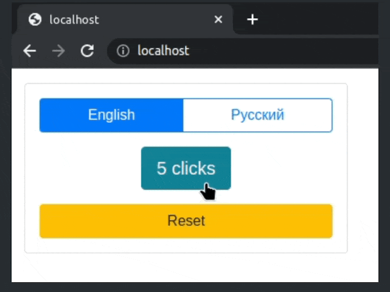

This project implements a multilingual (en-ru) click counter comprising a language switcher, a button to increment and display the number of clicks and a reset button.

The initial DOM state is like this.

```html
<div class="btn-group" role="group">
    <button type="button" class="btn mb-3 btn-primary">English</button>
    <button type="button" class="btn mb-3 btn-outline-primary">Русский</button>
</div>
<button type="button" class="btn btn-info mb-3 align-self-center">0 clicks</button>
<button type="button" class="btn btn-warning">Reset</button>
```

The DOM state after clicking the `btn-info` button twice and switching into Russian looks like this.

```html
<div class="btn-group" role="group">
    <button type="button" class="btn mb-3 btn-outline-primary">English</button>
    <button type="button" class="btn mb-3 btn-primary">Русский</button>
</div>
<button type="button" class="btn btn-info mb-3 align-self-center">2 клика</button>
<button type="button" class="btn btn-warning">Сбросить</button>
```

## Demo



## src/application.js

Exports a default function implementing the app logic, including the counter, language switching and reset buttons. UI texts are provided via the i18next library.

## src/locales/en.js

Houses a dictionary for the English language.

## src/locales.ru.js

Houses a dictionary for the Russian language. 